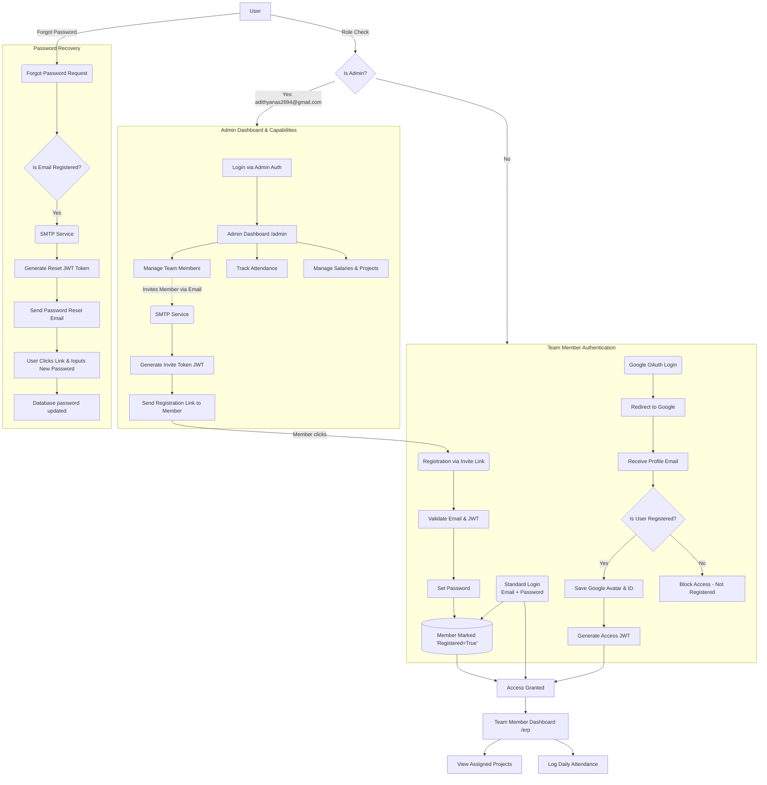

# ERP System Full Flowchart

This document illustrates the complete end-to-end flow of the ERP system, including the admin features, member authentication, Google OAuth integration, and SMTP-driven processes (like password resets and invitations).

## System Flowchart

## Flow Description

### 1. The Admin Flow
The **Admin** (identified by `adithyanas2694@gmail.com`) is the only user with access to `/admin` routes. The admin dashboard allows for complete oversight:
- **Team Management:** Add and manage existing members.
- **Invitations:** The admin specifies an email, which uses the **SMTP Service** to deliver a unique registration link along with an invite JWT token directly to the incoming team member's inbox.
- **Monitoring:** Track member attendance, manage project assignments, and calculate salaries.

### 2. The Team Member Registration Flow
When a user receives the invite email, they initiate the registration flow:
- They click the link containing a unique token.
- The system verifies the token, ensuring it hasn't expired or been used previously.
- The user creates their password, and their database record is updated to `registered: true`. Only after this point are they considered fully active.

### 3. The Login Flow (Standard & Google OAuth)
Registered members have two avenues for login:
1. **Standard:** They input their email and the password created during the registration flow. 
2. **Google OAuth:** When they attempt to use "Login with Google", the system redirects them to Google to authenticate. Upon returning, the system **checks if the user's email is already registered in the DB**.
   - **If yes:** The system syncs their avatar logic and logs them in seamlessly, generating a JWT string.
   - **If no:** The application terminates the flow and redirects the user with an "unauthorized/not registered" error, keeping the system exclusive to invited members.

### 4. The SMTP Password Recovery Flow
Should a user forget their password:
- They request a reset via the "Forgot Password" form.
- The system checks if the email exists and is marked as a registered user.
- If verified, the system generates a secure, time-limited reset JWT.
- The **SMTP Service** dispatches a "Reset Password" email to the user.
- Upon clicking the link in their inbox, they provide a new password, and their record is successfully overwritten, protecting their account from unauthorized resets.
